#Práctica 2º Trimestre José María Ramírez Gaitán

####1. Instalación de Apache

De la misma manera que hemos hecho anteriormente, escribimos:

```bash
    sudo apt install apache2
```
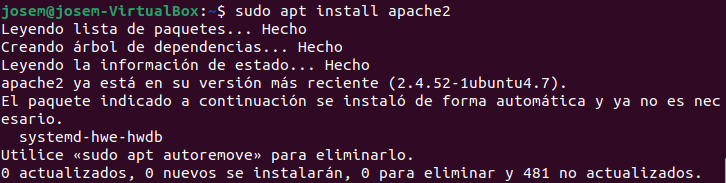

Para verificar el estado de apache, escribimos: 

```bash
    sudo systemctl status apache2
```
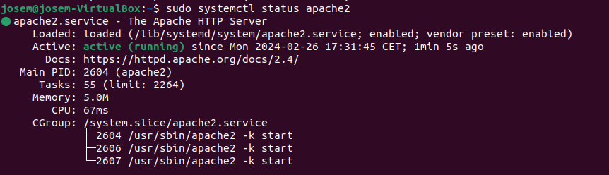

Para abrir el puerto http, para evitar problemas con firewalls , escribimos

```bash
    sudo systemctl status apache2
```
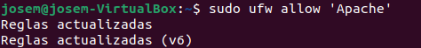

Reiniciamos el servidor con


```bash
    sudo systemctl restart apache2
```
Y ahora en http://localhost deberiamos tener la pagina de inicio de apache

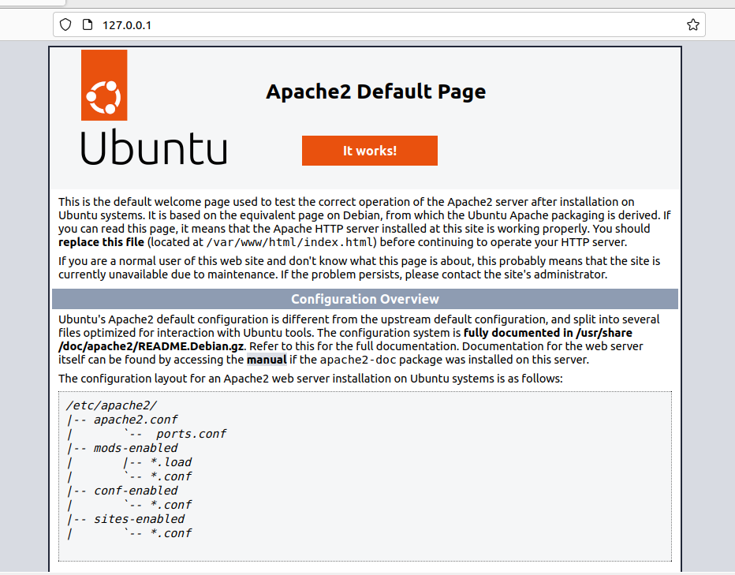

####2. Creación de página de inicio

Crearemos un documento y pondremos:

```bash
#!/bin/bash
#Ponemos esto #!/bin/bash para que se ejecute
echo "Introduzca su nombre:"
read user

# Crear
sudo useradd $user

# Pedir nombre del sitio
echo "Introduzca el nombre del sitio web:"
read site

# Crea el directorio para el sitio web
sudo mkdir /var/www/$site

# Asigna al usuario el directorio del sitio web y permitir acceso
sudo chown $user:$user /var/www/$site
sudo chmod 755 /var/www/$site

# Agregar el index al directorio
sudo echo "<html><body><h1>Bienvenido a $site!</h1></body></html>" > /var/www/$site/index.html
```

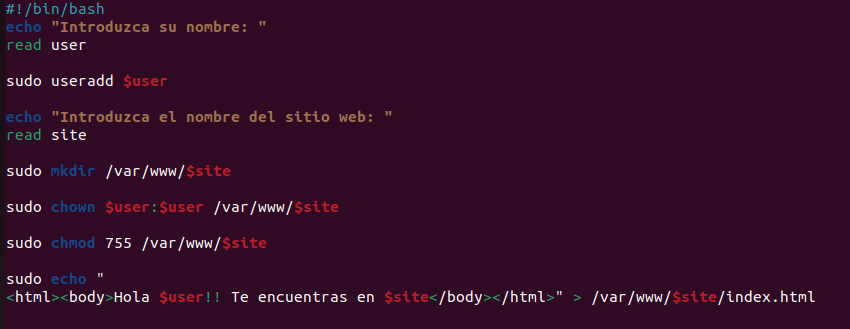

####3. Instalar sql

Debemos poner:

```bash
    sudo apt-get install mysql-server
```

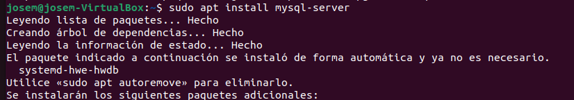

Lo iniciamos con 

```bash
   systemctl start mysql
```

y verificamos su estado con

```bash
    sudo systemctl status mysql
```
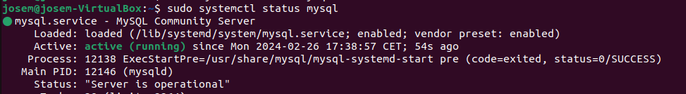

####4. Instalación de php

Instalamos php con:
```bash
sudo apt install php libapache2-mod-php php-mysql
```
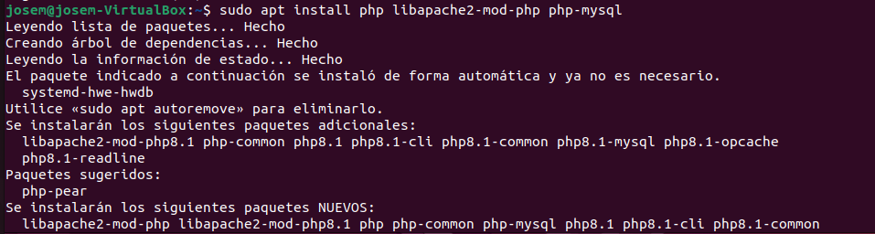

Para comprobar si esta instalado, podemos poner varios comandos, aunque yo me decanté por

```bash
 php -v
```
Que indica la versión

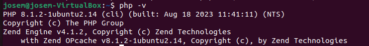
 Reiniciamos el servidor para que se apliquen los cambios
```bash
    sudo systemctl restart apache2
```

####5. Instalación de phpmyadmin

Para instalar phpmyadmin ponemos:
```bash
    sudo apt install phpmyadmin
```
Una vez instalado nos saldrá: 
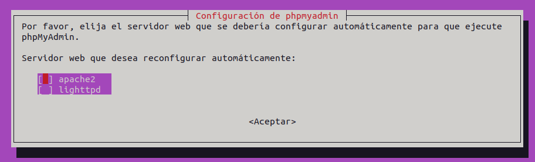
Usaremos Apache, y a continuación nos saldrá una ventana preguntando si queremos reinstalar la base de datos, pulsamos en sí, e introduciremos a continuación la contraseña:
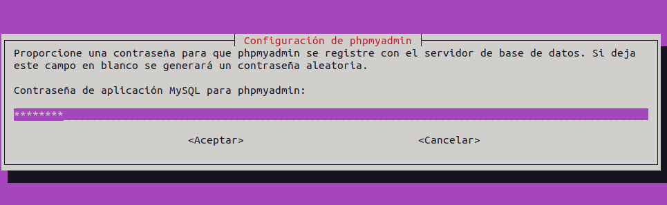

Lo último es reiniciar el servidor 
```bash
    sudo systemctl restart apache2
```

Ahora en localhost/phpmyadmin deber aparecernos 
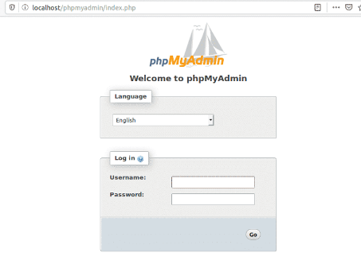

####6. Instalción de ftp

Instalamos el servidor vsftpd con 
```bash
    sudo apt-get install vsftpd
```
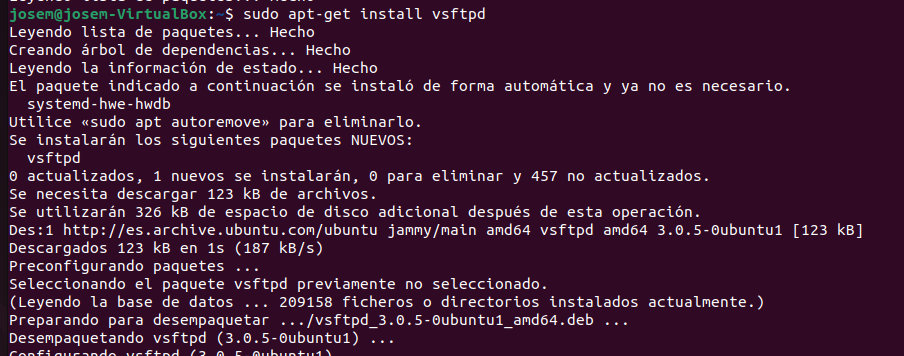

Para garantizar una conexion segura, debemos tener un certificado TLS, el cual podremos obtener con:

```bash
sudo openssl req -x509 -nodes -days 365 -newkey rsa:2048 -keyout /etc/ssl/private/vsftpd.pem -out /etc/ssl/private/vsftpd.pem
```
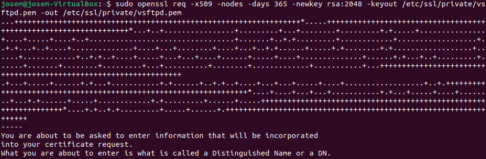

Lo siguiente será acceder a la configuración con:

```bash
sudo nano /etc/vsftpd.conf
```

y escribir lo siguiente

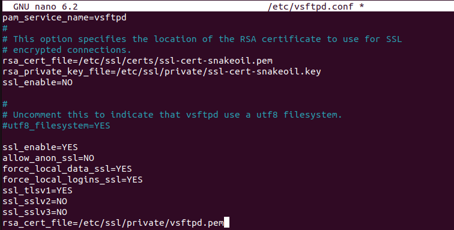

y reiniciamos el servidor con 
```bash
sudo systemctl restart vsftpd
```
####7. Instalación de ssh

Lo instalamos con 
```bash
sudo systemctl restart vsftpd
```
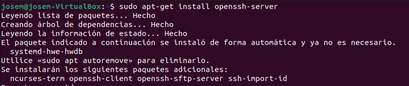

Accedemos a la configuración por 
```bash
sudo nano /etc/ssh/sshd_config
```
y quitamos la almohadilla de delante del port
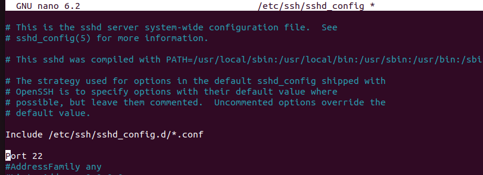

reiniciamos el servidor con 

```bash
sudo systemctl restart ssh
```
Y para evitar problemas con firewalls escribimos 
```bash
sudo ufw allow ssh
```
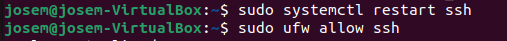

####8. Script de automatización

Dividiremos el script en varias funciones que realicen cada acción.

En la primera, pediremos al usuario su nombre, el del subdmonio y su ip, y crearemos al usuario

```bash 
	read -p "Introduzca el nombre de usuario: " user
	read -p "Introduzca el nombre del subdomain: " subdomain
	read -p "Introduzca la IP del cliente: " ip
	useradd -m -d /var/www/$subdomain $user
```

En la segunda crearemos el virtualhost:

```bash 
	sudo cp /etc/apache2/sites-available/000-default.conf /etc/apache2/sites-available/$user.conf
				echo "<VirtualHost *:80>
				    ServerAdmin admin@example.com
				    ServerName $user.com
				    ServerAlias www.$user.com
				    DocumentRoot /var/www/$user
				    ErrorLog ${APACHE_LOG_DIR}/error.log
				    CustomLog ${APACHE_LOG_DIR}/access.log combined
				</VirtualHost>" >> /etc/apache2/sites-available/$user.conf
	sudo a2ensite $user.conf
```
En la tercera función, configuraremos el DNS para generar la zona directa e inversa del subdominio
```bash
	# Añadimos la zona 
	echo "zone \"$subdomain\" {
	    type master;
	    file \"/etc/bind/db.$subdomain\";
	};" >> cat /etc/bind/named.conf.local

	# Creamos el archivo de zona
	sudo cp /etc/bind/db.empty /etc/bind/db.$subdomain
	sudo chown bind:bind /etc/bind/db.$subdomain

	# Añadimos los registros al archivo
	echo "\$TTL 86400
	@       IN      SOA     $subdomain.      admin.$subdomain. (
		                2023021801      ; serial
		                3600            ; refresh
		                1800            ; retry
		                604800          ; expire
		                86400 )         ; minimum

		IN      NS      $subdomain.

	$subdomain.       IN      A       $ip" >> cat /etc/bind/db.$subdomain

	echo "$ip       IN      PTR     $subdomain." >> cat /etc/bind/db.10

	#Reiniciamos BIND
	sudo systemctl restart bind9
```
Otra función para crear la base de datos

```bash
	mysql -e "CREATE DATABASE $user; CREATE USER '$user'@'localhost' IDENTIFIED BY 'password'; 
	GRANT ALL PRIVILEGES ON $user.* TO '$user'@'localhost'; FLUSH PRIVILEGES;"
```

Y para acabar, otra para habilitar y deshabilitar Web Server Gateway interface de python (wsgi)

Lo primero sera instalarlo

```bash 
    sudo apt-get install libapache2-mod-wsgi-py3
```
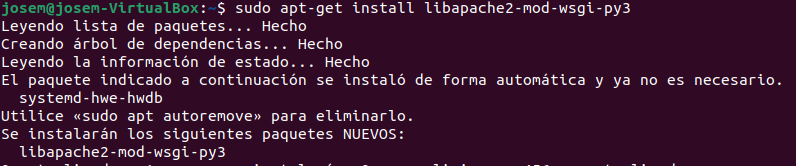

El script completo es:

```bash 
#!/bin/bash
function userCreate {
	read -p "Introduce el nombre de usuario: " user
	read -p "Introduce el nombre del subdominio: " subdomain
	read -p "Introduce la IP del cliente: " ip
    useradd -m -d /var/www/$subdomain $user
}

function createVirtualHost {
	read -p "Introduzca el nombre de usuario: " user
	read -p "Introduzca el nombre del subdominio: " subdomain
	read -p "Introduzca la IP del cliente: " ip
	sudo cp /etc/apache2/sites-available/000-default.conf /etc/apache2/sites-available/$user.conf
				echo "<VirtualHost *:80>
				    ServerAdmin admin@example.com
				    ServerName $user.com
				    ServerAlias www.$user.com
				    DocumentRoot /var/www/$user
				    ErrorLog ${APACHE_LOG_DIR}/error.log
				    CustomLog ${APACHE_LOG_DIR}/access.log combined
				</VirtualHost>" >> /etc/apache2/sites-available/$user.conf

	sudo a2ensite $user.conf
}

function dnsConfig {
	read -p "Introduzca el nombre de usuario: " user
	read -p "Introduzca el nombre del subdominio: " subdomain
	read -p "Introduzca la IP del cliente: " ip

	echo "zone \"$subdomain\" {
	    type master;
	    file \"/etc/bind/db.$subdomain\";
	};" >> cat /etc/bind/named.conf.local

	sudo cp /etc/bind/db.empty /etc/bind/db.$subdomain
	sudo chown bind:bind /etc/bind/db.$subdomain

	echo "\$TTL 86400
	@       IN      SOA     $subdomain.      admin.$subdomain. (
		                2023021801      ; serial
		                3600            ; refresh
		                1800            ; retry
		                604800          ; expire
		                86400 )         ; minimum

		IN      NS      $subdomain.

	$subdomain.       IN      A       $ip" >> cat /etc/bind/db.$subdomain

	echo "$ip       IN      PTR     $subdomain." >> cat /etc/bind/db.10

	sudo systemctl restart bind9
}

function dbCreate {
	read -p "Introduzca el nombre de usuario: " user
	read -p "Introduzca el nombre del subdominio: " subdomain
	read -p "Introduzca la IP del cliente: " ip
#Crear una base de datos y un usuario con todos los permisos
	mysql -e "CREATE DATABASE $user; CREATE USER '$user'@'localhost' IDENTIFIED BY 'password'; 
	GRANT ALL PRIVILEGES ON $user.* TO '$user'@'localhost'; FLUSH PRIVILEGES;"
}

function activateWsgi {
	a2enmod wsgi
}

function desactivateWsgi {
	sudo a2dismod wsgi
}

function init 
	{
		echo "Buenos dias ¿que desea hacer hoy?"
		echo "1. Crear usuario"
		echo "2. Crea el VirtualHost"
		echo "3. Configurar DNS"
		echo "4. Crear base de datos"
		echo "5. Habilitar ejecución de aplicaciones con python"
		echo "6. Deshabilitar ejecución de aplicaciones con python"
		echo "7. Salir"
		echo "Dime tu opcion"
		read opc
		case $opc in
			1)userCreate;;
			2)createVirtualHost;;
			3)dnsConfig;;
			4)dbCreate;;
			5)activateWsgi;;
			6)desactivateWsgi;;
			7)exit;;
			*)echo "La opción escogida es incorrecta";sleep 3;clear;menu;;
		esac
	}
init
```

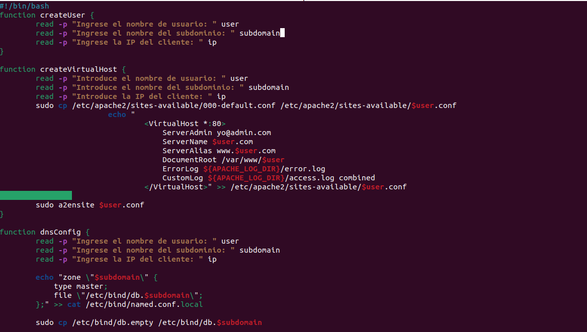
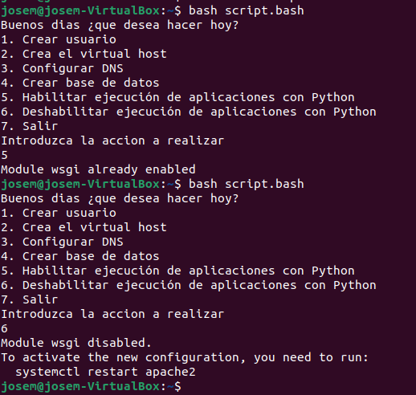


