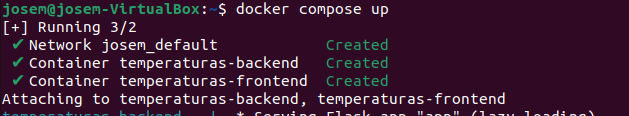

# Trabajo Docker

###  1. Instalación de docker

Lo primero a hacer será instalar curl con 

```bash
 $ sudo apt-get update
 $ sudo apt-get install ca-certificates curl gnupg
```


A continuación, conseguiremos docker la clave GPG oficial de coker y su repositorio


lo siguiente seráinstala docker engine con
```bash
$ sudo apt-get update
$ sudo apt-get install docker-ce docker-ce-cli containerd.io docker-buildx-plugin docker-compose-plugin
```
Y creamos un usuario sin privilegios


Con el siguiente comando, podemos ver la versión


Instalamos a version de la comunidad con 

```bash
$ apt install docker.io
```
### 2. Creación de contenedor con la imagen hello-world

Para instalarla, hemos de haber instalado la versión de la comunidad, con el siguiente comando se descargará y ejecutará el contenedor


Para ver las imagenes instaladas que tenemos, debemos usar


En mi caso tenía otras dos instaladas, y para mostrar los contenedores:


Con docker ps -a nos mostrará todos los contenedores, si solo queremos ver los activos, debemos quitar e -a, aunque en este caso, al ser un contenedor que solo hace un print de hello world, no saldrá ahí, ya que se parará solo al hacerlo

### 3. Descarga de imagenes y ejecución de contenedores

Las tres imágenes a instalar serán hello-worl, la cual ya está instalada, ubuntu y nginx. Para ello debemos usar

```bash 
$ docker pull imagen
```


Para crear un contenedor con el nombre personalizado; debemos usar, en este caso:

```bash 
$ docker run --name myhello1 hello-world
$ docker run --name myhello2 hello-world
$ docker run --name myhello3 hello-world
```

Al hacer docker ps -a veremos:


Para parar los contenedores, en caso de que estén en ejecución debemos ejecutar en este caso:

```bash
$ docker stop myhello1
$ docker stop myhello2
```

Una vez parados, se podrán eliminar con

```bash
$ docker rm  myhello1
```
Aquí el resultado después de borrar


Y para borrar todos, repetiremos el proceso


### 4. Almacenamiento y redes de docker

###### Ejemplo1. Guestbook
Lo primero será establecer la red que conectará los dos contenedores`
```bash
$ docker network create red_guestbook
```

Una vez creada, creamos los contenedores conectados por esa misma red


Ahora solo queda ir al navegador y acceder por local


Los otros dos ejemplos seguirán los mismo pasos, por lo que solo pondré las imágenes

###### Ejemplo2. Temperaturas


###### Ejemplo3. Wordpress


###5. Uso y creación del docker-compose

###### Ejemplo1. Guestbook
Lo primero a hacer, es crear el archivo docker-compose.yaml y editarlo en función de nuestras necesidades


Una vez creado, lo ejecutamos


Podremos acceder a él de la misma manera que en los ejemplos anteriores


Lo último será pararlos y eliminarlos 


De la misma manera que en el anterior apartado, simplemente pondré las imágenes para evitar la redundancia con el ejemplo anterior

###### Ejemplo2. Temperatura





###### Ejemplo3. Wordpress


